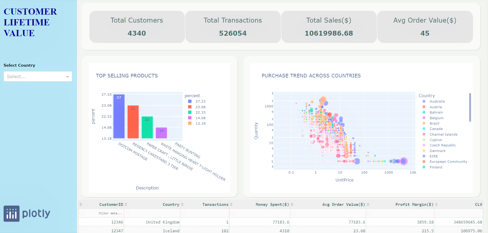

# Python App to Measure Customer Lifetime Value (CLV)

Customer Lifetime Value is the profit that a business will make from a specific customer over the period of their association with the business. Every industry has its own set of metrics that are tracked and measured to help businesses target the right customer and forecast their customer base for the future. The CLV may change depending on the business model and its objective which means the definition and calculation need to be revisited regularly. The app helps businesses identify, segment, understand customers and products better. 

## [Read more on my blog](https://www.analyticsvidhya.com/blog/2021/08/create-a-python-app-to-measure-customer-lifetime-value-clv/?)

## Here is the preview of the app: 

